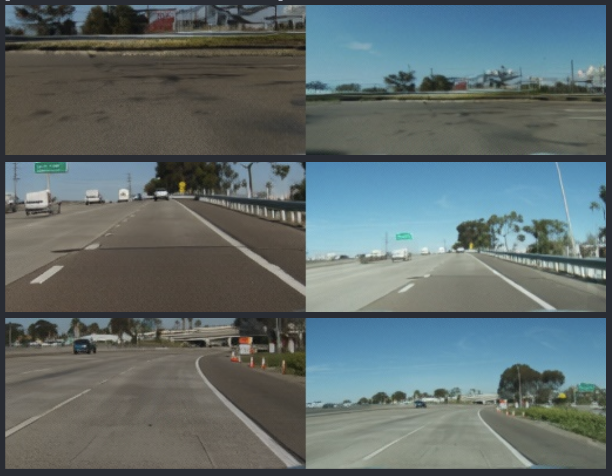
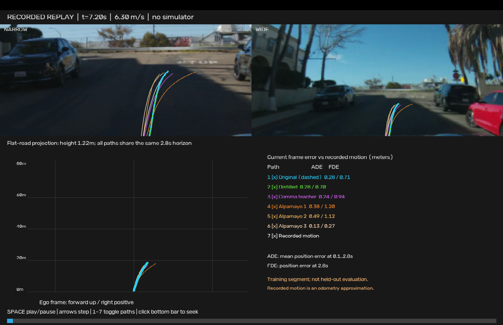

# World models are more powerful than I thought

I went to [COMMA_HACK 7](https://blog.comma.ai/comma-hack-7/) with an idea: try running a much larger driving model on Chestnut.

[Chestnut](https://blog.comma.ai/chestnut/) makes desktop GPU compute available to openpilot over USB. The ready-to-drive setup includes an AMD GPU with 8 GB of memory, and comma already has a roughly 1B-parameter driving policy for this class of hardware.

Over the three-day hackathon, my original idea turned into a different experiment: using larger models to teach a smaller driving policy inside a learned simulator.

I came away with a working pipeline, almost no measurable improvement in the policy, and a much better understanding of why world models are interesting.

## First, try a bigger model

My first target was [Alpamayo 1.5 10B](https://huggingface.co/nvidia/Alpamayo-1.5-10B). I also considered [Qwen-Drive-1.0-4B](https://huggingface.co/Qwen/Qwen-Drive-1.0-4B), but the configuration I looked at expected front, left, and right camera views alongside ego-motion history. Comma has forward-facing narrow and wide cameras. Adapting those inputs would require more than renaming camera fields, so I focused on Alpamayo.

Even there, accepting comma’s camera crops did not establish that the model would perform well on them. It was a starting point for experimentation.

I tried aggressive weight-only quantization: **W4A16**, with 4-bit weights and 16-bit activations. The converted weights occupied about 6.57 GB, and the estimated runtime footprint was close to the GPU’s 8 GB limit. That left little room for longer context or unexpected allocations.

My inference attempts still took minutes for a single observation. Getting the weights into memory was only part of the problem. Efficient execution, attention, temporary buffers, and repeated decoding all mattered. I also had not calibrated the quantization to preserve driving-action quality.

That made me reconsider what I actually needed from the larger model.

**Could it teach the policy that already runs on Chestnut?**

## Trajectories as a shared language

A model that produces a plausible trajectory cannot automatically replace openpilot’s driving model. The existing stack also expects action targets, recurrent state, and other outputs used throughout the system.

For this experiment, trajectories became the shared language between models:

| Model | Trajectory in my pipeline |
|---|---|
| Alpamayo 1.5 | 64 future points over 6.4 seconds, uniformly spaced |
| Comma driving policy | 33 points over 10 seconds, more densely spaced near the present |
| Comma world-model planning head | The same 33-point time grid |

I could transform coordinates, align timestamps, and train against compatible targets without making the models share an architecture.

But collecting teacher predictions on recorded video leaves an important gap: the student eventually encounters situations caused by its own actions. A small mistake changes its position, which changes what it sees, which affects its next action.

I wanted the training loop to include those consequences.

## Let the student drive inside a world model




Comma’s [openpilot 0.11 writeup](https://blog.comma.ai/011release/) describes training a driving policy through interactions with a learned simulator. Its released [4B world model](https://huggingface.co/commaai/worldmodel-4B) predicts paired-camera observations and driving plans, conditioned on frame history, ego motion, and future anchors.

In my pipeline, the loop looked like this:

**Camera history → student action → vehicle motion → world-model frame → next student action**

A vehicle model converts the student’s curvature and acceleration into a new pose. The world model generates the corresponding observation. The student then acts again on that generated history.

The student’s sampled actions control the rollout. The teachers provide supervision on the states it visits. That is what makes this **on-policy distillation**.


I initialized the student from comma’s existing big driving policy and fine-tuned its plan and action heads. There were two teachers: the comma world model’s planning head and Alpamayo, which supplied multiple candidate trajectories.

Cloud services handled the expensive simulator and teacher inference. I later moved the Modal deployment to A100-40GB instances and verified both teachers there. The compiled comma policy ran locally on the Chestnut AMD GPU through [tinygrad’s eGPU support](https://docs.tinygrad.org/tinygpu/).

This gave the larger models a different role. Their inference cost could be paid during training, while the deployed policy stayed small enough to run locally.

## Why recovery pressure matters

The most interesting concept I encountered was **recovery pressure**.

Imagine the student drifts away from the recorded path. A teacher might predict a plausible continuation from that new position, but that continuation does not necessarily bring the student back. A future-anchored teacher also sees a desirable future state and can produce a trajectory that reconnects the current situation to it.

That future conditioning is the source of recovery pressure in comma’s formulation. The teacher has information during offline training that the deployed policy will never receive. [Learning to Drive from a World Model](https://arxiv.org/html/2504.19077v1) explains this distinction.

It also changed how I thought about multiple teachers. Alpamayo can suggest alternative trajectories, but those samples are not guaranteed to recover toward the same recorded future. A reasonable-looking path and a useful recovery target are different things. Deciding which teacher to trust, and when, is part of the training problem.

There is a related idea in [Video PreTraining](https://arxiv.org/abs/2206.11795): use an inverse dynamics model with access to surrounding frames to infer actions, then train a policy that acts from past observations. [Standard Intelligence’s FDM-1](https://si.inc/posts/fdm1/) similarly uses inverse dynamics to label video with actions.

The architectures and tasks differ, but the connection helped me: training can use information and computation that would be unavailable or too expensive at deployment.

## A working pipeline fro demo

After the short training experiment, I evaluated the checkpoint on recorded segment 1. It had trained on segment 0 of the same route.

This was an off-policy evaluation: every model received recorded observations, and its predictions did not change the next frame. I saved 253 comparisons and evaluated the trajectories on the same 28 timestamps, covering 0.1–2.8 seconds into the future.



The result was almost unchanged:

| Policy | Mean trajectory error |
|---|---:|
| Original compiled comma `big-driving-supercombo` | 0.887 m |
| Distilled policy | 0.886 m |

That difference does not demonstrate a meaningful improvement. Training was limited, and the evaluation used another segment of the same route, so it was not a broad test of generalization. The reference trajectory came from approximate odometry, and the prepared camera crops differed from modeld’s live preprocessing. The world teacher’s access to future anchors also makes its error an unfair comparison with a causal policy.

Recorded replay helped me inspect predictions and check the pipeline. It did not establish better closed-loop driving or recovery.

What I built gives me a way to investigate more specific questions: Where does the student struggle? Which teacher supplies a useful target in those situations? Does following that target actually improve recovery when the student controls the rollout?

Comma’s existing driving policy was already a strong starting point. My hackathon experiment barely changed its measured performance, but building the loop changed my understanding of how such policies can be trained.

I arrived wanting to fit more intelligence onto an 8 GB GPU. I left interested in how much computation and how much knowledge of the future. we can put into training a policy that fits there.


## Quickstart for a demo `replay` with `modeld`

```
# UI
BIG=1 python -m openpilot.selfdrive.ui.onroad.augmented_road_view


# Replay
openpilot/tools/replay/replay --demo --wide-road \
                                                     --block modelV2,drivingModelData,cameraOdometry


# Driving model
python -m openpilot.selfdrive.modeld.modeld --demo
```